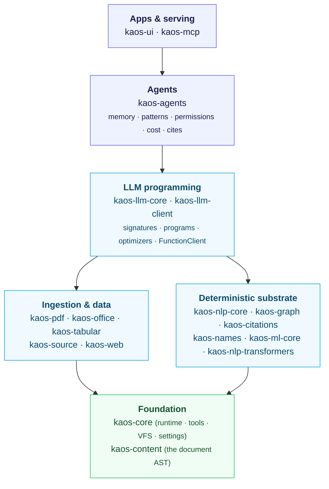
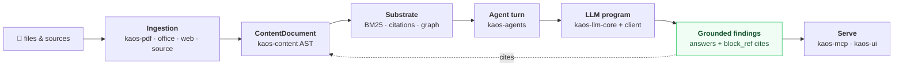

KAOS is not one framework — it's a stack of small packages that share one runtime
and one document model, so they compose. Understanding the **layers** and the
**dependency direction** is the fastest way to know which package you need.

## The five layers

Dependencies point **downward** — higher layers build on lower ones, never the
reverse. You can adopt as little as one layer.

<small>Dependencies point downward — adopt as little as one layer.</small>

## How a request flows

A typical "answer a question over my documents" task touches the stack
top-to-bottom and back:

1. **Ingestion** (`kaos-pdf`/`kaos-office`/`kaos-web`/`kaos-source`) turns real files
   and sources into a **`ContentDocument`** (`kaos-content`).
2. The **deterministic substrate** (`kaos-nlp-core` BM25, `kaos-citations`,
   `kaos-graph`) indexes, searches, and structures that content — fast, offline.
3. An **agent** (`kaos-agents`) runs a turn: it assembles memory, retrieves relevant
   content, and calls an **LLM program** (`kaos-llm-core`) through a **client**
   (`kaos-llm-client`).
4. The agent returns **grounded findings** — answers with `block_ref` citations back
   into the source documents — under a cost budget and a permission policy.
5. The whole thing can be **served over MCP** (`kaos-mcp`) to an AI client, or wrapped
   in an **app** (`kaos-ui`).

## Two key design choices

- **One document model.** Because every extractor produces the same
  `kaos-content` AST, search, citation, LLM, and agent code is written once — not
  per format. (See [build a document](/tutorials/build-a-document).)
- **One client interface, fake or real.** `kaos-llm-client` exposes every provider
  through one interface, and ships a deterministic `FunctionClient`. That's why this
  whole site runs and tests **offline**. (See
  [the FunctionClient seam](/tutorials/offline-llm-with-functionclient).)

## Where to start

- Build something: follow the [tutorial spine](/tutorials/first-tool).
- Just evaluate: [run an example](/get-started/first-example) in 10 seconds.
- Find the package for a task: [pick your path](/learning-paths).

:::tip
See the [package reference](/reference/packages) for the per-package tool, CLI, and
settings details — generated from each package and drift-checked in CI.
:::
