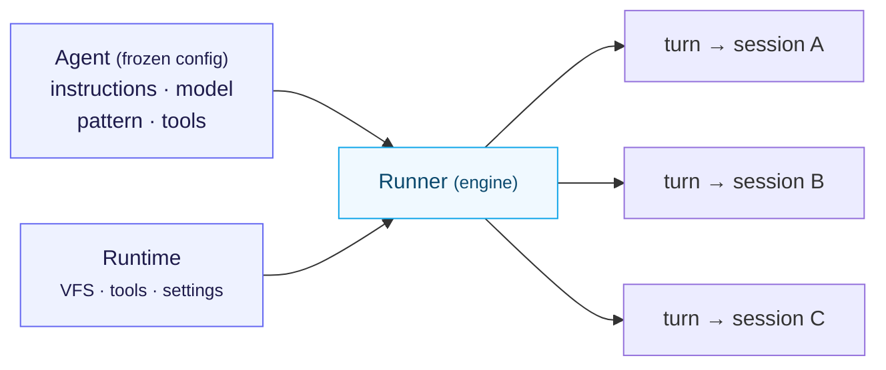

In KAOS, an "agent" is two things, deliberately kept apart:

- An **`Agent`** is frozen *configuration*: instructions, model, pattern, tools, settings.
  It holds no state and runs nothing. You can construct it once and share it freely.
- A **`Runner`** is the *engine*: it drives an `Agent` against a runtime, manages a turn,
  dispatches tools, evaluates permissions, fires hooks, and records cost.

You saw this in [your first agent](/tutorials/first-agent): `agent = Agent(...)` then
`runner = Runner(agent, runtime=...)` then `await runner.turn(...)`.



<small>One frozen <b>Agent</b> + a <b>Runtime</b> → a <b>Runner</b> that drives many independent sessions.</small>

## Why split them

- **The agent is reconstructable.** Because config is frozen and state lives elsewhere
  (see [memory](/concepts/memory-as-context-assembly)), the same agent definition can be
  rebuilt identically on any machine, in any process — which is exactly what an MCP
  request needs. The agent is *stateless*; the session is where memory lives.
- **One agent, many sessions.** The Runner hydrates the right session's memory each turn,
  so a single `Agent` definition serves thousands of concurrent conversations without
  cross-talk.
- **Cross-cutting concerns belong to the engine.** Permissions, hooks, cost accounting,
  and circuit breakers are Runner responsibilities — they apply to *every* turn regardless
  of which agent runs, so they don't clutter agent config.

This mirrors the OpenAI Agents SDK's "Agent = config, Runner = engine" split, adapted for
KAOS's typed settings and tool-glob patterns.

## The mental model

```
Agent (frozen config)              Runner (engine)            Session (state)
─────────────────────              ───────────────            ───────────────
instructions, model,    ──run──>   turn loop, tools,   <───>  SessionMemory
pattern, tools                     permissions, hooks,        (hydrated from VFS
(stateless, shareable)             cost, breakers              each turn)
```

Keep this in mind and the rest of the agent system — memory, patterns, permissions —
slots into place: they're all things the *Runner* does to a *stateless* agent over a
*persistent* session.
