A KAOS agent turn isn't a black box that returns an answer. It's an **event stream** —
a sequence of typed events you can watch, record, and trace. Running `runner.run(...)`
yields events as they happen; `runner.turn(...)` aggregates them into a response.

## Two kinds of events

- **Spans** mark phase boundaries — turn start/complete, step start/complete, tool-call
  start/complete, sub-agent lifecycle, handoffs. Each `Span` carries a subject (what) and
  a phase (start/complete/error), plus a span id, parent span id, duration, and
  attributes. Consumers pattern-match on `(subject, phase)`.
- **Value events** carry facts beyond a boundary: `IntentClassified`, `PlanProposed`,
  `CitationFound`, `UsageObserved`, `EvidenceInsufficient`, `TurnSummary`, `MemoryEvent`,
  and the error events. Consumers use `isinstance` on these.

A turn's stream interleaves the two — **spans** (indigo) bound phases, **value events**
(amber) carry facts:

```mermaid
flowchart LR
    s1["Span TURN<br/>▶ start"] --> ic["IntentClassified"]
    ic --> st["Span STEP<br/>▶ start"]
    st --> tc["Span TOOL<br/>▶ start · ◀ complete"]
    tc --> cf["CitationFound"]
    cf --> sc["Span STEP<br/>◀ complete"]
    sc --> us["UsageObserved"]
    us --> ts["TurnSummary"]
    ts --> s2["Span TURN<br/>◀ complete"]

    classDef span fill:#eef2ff,stroke:#6366f1,color:#1e1b4b;
    classDef val fill:#fef9c3,stroke:#ca8a04,color:#713f12;
    class s1,st,tc,sc,s2 span;
    class ic,cf,us,ts val;
```

## Aligned with OpenTelemetry

The Span model maps directly onto OpenTelemetry spans, so an `OTelHook` can emit standard
traces for turns, tool calls, and steps. Your agent's internals show up in the same
tracing tools you already use for services — no bespoke observability layer.

## Why an event stream

- **Streaming UIs come for free.** The single-user-chat reference app renders tokens,
  tool calls, and citations live by consuming this stream over SSE.
- **Audit and replay.** The same events feed an [audit trail](/concepts/the-audit-trail)
  — a durable, redacted record of what the agent did and why.
- **Composability.** Hooks (logging, cost tracking, OTel, circuit breakers) observe the
  stream uniformly, so cross-cutting behavior doesn't have to be wired into each pattern.

## The mental model

Think of a turn as a trace: nested spans for phases, value events for facts. Everything
the agent does is observable through one typed interface — which is what makes KAOS agents
debuggable, traceable, and safe to run unattended.
