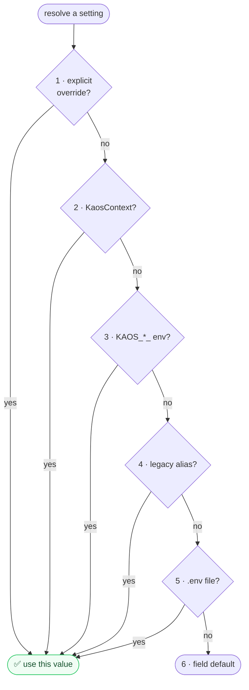

Every package configures itself through a typed `ModuleSettings` subclass — not scattered
`os.getenv` calls. That gives one predictable resolution order and one place for secrets.

## The precedence (highest wins)

1. **Explicit overrides** passed in code.
2. **`KaosContext`** values (per-request config).
3. **`KAOS_<MOD>_*` environment variables** (e.g. `KAOS_AGENT_MAX_COST_USD`).
4. **Documented legacy-alias** env vars (for backward compatibility).
5. **`.env`** file.
6. **Field defaults**.

The first level that provides a value wins; everything below is a fallback.

## Why it matters

- **Predictable.** You always know *why* a setting has its value and how to override it.
- **Secret-safe.** API keys are typed as `pydantic.SecretStr`, so they're redacted from
  logs, errors, CLI/JSON output, and serialized settings — you can't accidentally print a
  key.
- **Per-request when needed.** Level 2 lets a single process serve many tenants/sessions
  with different config without mutating globals.

See the [environment variables reference](/reference/env-vars) for the per-package
prefixes, and [add typed settings](/how-to/add-typed-settings) for the hands-on pattern.
