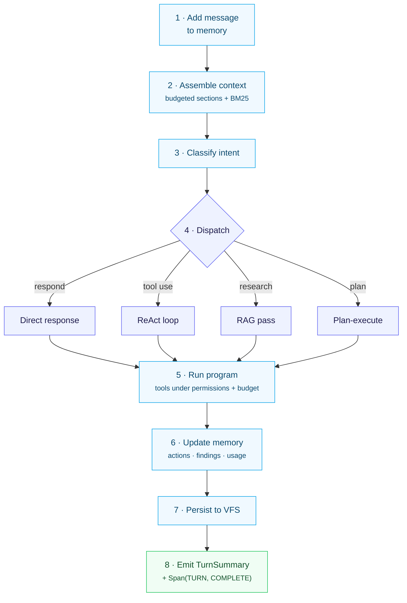

A [Runner](/concepts/agent-vs-runner) turn isn't a single LLM call — it's a structured
loop. Understanding its shape makes agent behavior predictable and debuggable.

## The anatomy of a turn

1. **Add the message** to session memory.
2. **Assemble context** — [budgeted section assembly](/concepts/memory-as-context-assembly),
   with BM25 retrieval over large sections.
3. **Classify intent** — what does the user want (respond, tool use, research, plan,
   clarify)?
4. **Dispatch** to the matching behavior: a direct response, a ReAct tool loop, a research
   (RAG) pass, or a plan-execute run.
5. **Run the chosen program**, calling tools under the [permission policy](/concepts/session-enforcement)
   and the [cost budget](/concepts/cost-as-a-contract).
6. **Update memory** — record actions, findings (with citations), and usage.
7. **Persist** the session to the VFS.
8. **Emit a `TurnSummary`** — the typed aggregate (text, tokens, cost) alongside the
   terminal `Span(TURN, COMPLETE)`.

## Why a loop, not a call

- **Observability.** Each step emits [events](/concepts/events-and-spans), so the whole
  turn is traceable and auditable.
- **Control.** Permissions, cost, and circuit breakers apply *between* steps — the loop is
  where the guardrails live.
- **Composability.** ReAct is the inner loop; the agent is the outer loop. The agent
  decides *which* program to run; the program drives the model. Patterns (chat, research,
  findings, plan-execute) differ only in step 4's dispatch.
