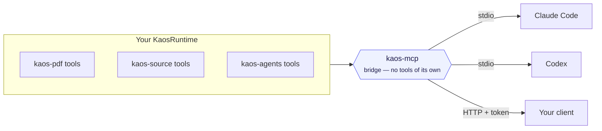

KAOS is MCP-native: every [tool](/tutorials/first-tool) is already typed and annotated for
the [Model Context Protocol](https://modelcontextprotocol.io). `kaos-mcp` is the **bridge**
that serves a runtime's tools (and content resources) to any MCP client — Claude Code,
Codex, or your own.

## A bridge, not a toolbox

`kaos-mcp` registers **no tools of its own**. It mounts whatever runtime you give it and
exposes that runtime's tools. So the surface an MCP client sees is entirely determined by
which packages you loaded — `kaos-pdf` + `kaos-source`, say, or the full agent stack. One
bridge, any composition.

## Transports

- **stdio** — `kaos-mcp serve` (or each package's `kaos-*-serve`). The default for
  desktop AI clients that spawn a subprocess.
- **streamable HTTP** — `--http`, which **requires an explicit auth token** (the bridge
  refuses to expose tools over the network unauthenticated — see
  [session enforcement](/concepts/session-enforcement)).

## Resources and URIs

Beyond tools, the bridge exposes content as MCP **resources** addressed by `kaos://` URIs,
so a client can read artifacts and documents the runtime produced, not just call tools.

## Why this design

Keeping the protocol bridge separate from the tools means packages stay usable as plain
Python libraries *and* as MCP servers, with no protocol code leaking into domain logic.
Adding MCP to anything is "mount it on the bridge," not "rewrite it."
