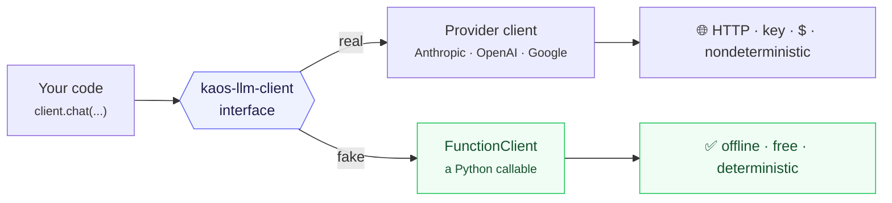

Most documentation for LLM tooling can't run its own examples: they need an API key,
cost money, and give different output every time. So the examples rot, quietly, until
a reader copies one that no longer works.

Learn KAOS takes a different stance: **every example runs offline, for free, and is
tested in CI.** The mechanism is a single design choice in `kaos-llm-client`.

## One interface, two implementations

`kaos-llm-client` exposes every provider — Anthropic, OpenAI, Google — through one
interface (`client.chat(...)`, structured output, streaming, cost accounting). It also
ships a **`FunctionClient`**: a client that runs a Python callable instead of making an
HTTP request, while satisfying that *same* interface.



So your code calls `client.chat(...)` identically whether the client is a real provider
or a deterministic fake. Only the model changes:

```python
client = FunctionClient(function=fake_model)   # offline, free, deterministic
# vs
client = create_client("anthropic:claude-haiku-4-5")   # live
```

This is the seam the [FunctionClient tutorial](/tutorials/offline-llm-with-functionclient)
teaches. Every LLM example uses a `make_client()` that returns the fake by default and
the real one when `KAOS_LEARN_LIVE=1` is set.

## Why this matters for *you*

- **The code you read is the code that's tested.** Pages import their example files
  byte-for-byte; CI runs those files on every change. A broken example fails the build.
- **You can run everything with no account.** Learn the whole spine before you ever pay
  for a token.
- **Your own tests get faster and cheaper.** The same `FunctionClient` makes *your*
  LLM code deterministic and offline in your test suite — see
  [write a tested example](/how-to/test-your-own-snippets).

## Determinism beyond LLMs

Many KAOS packages are deterministic by nature — `kaos-citations`, `kaos-graph`,
`kaos-nlp-core`, `kaos-content`, `kaos-core`. They need no seam at all: same input,
same output, always. That's why the [gallery](/gallery) leads with them — the most
convincing demo is one that runs identically on your machine and ours.
