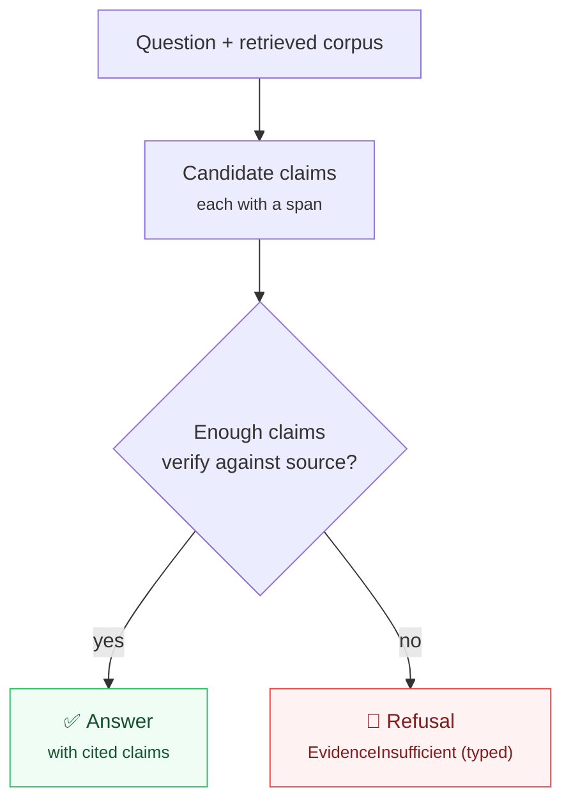

The most dangerous thing a legal or financial assistant can do is answer confidently when
it shouldn't. A plausible-sounding but unsupported answer is worse than no answer — it
gets relied upon.

KAOS makes refusal a **first-class, typed outcome**, not an afterthought.

## Refuse rather than hallucinate

When a research agent can't find adequate support for an answer in the retrieved corpus,
it doesn't paper over the gap with a guess. It emits a typed signal —
`EvidenceInsufficient` / a grounded-refusal event — that downstream code can branch on.
"I don't have enough to answer that" is a valid, expected, machine-readable result.

This pairs directly with [grounded citations](/tutorials/grounded-citations): every claim
must carry a span that **verifies** against the source. If the support isn't there, the
claim is rejected — and if too many claims are rejected, the answer becomes a refusal
rather than a fabrication.

## Why typed, not just a string

Because refusal is a typed outcome:

- **Callers can act on it.** A pipeline can route an insufficient-evidence result to a
  human, widen the search, or ask a clarifying question — deterministically.
- **It can't be mistaken for an answer.** A free-text "I'm not sure..." can slip through a
  consumer that just renders the text. A typed refusal can't.
- **It's measurable.** You can track refusal rate as a quality signal — too high means
  retrieval is failing; too low might mean the agent is over-claiming.

## The principle

This is the same stance as [why plain BM25](/concepts/why-plain-bm25) and
[cost as a contract](/concepts/cost-as-a-contract): prefer the honest, accountable
default. An agent that knows when to say "not enough evidence" is more trustworthy than
one that always has an answer.
