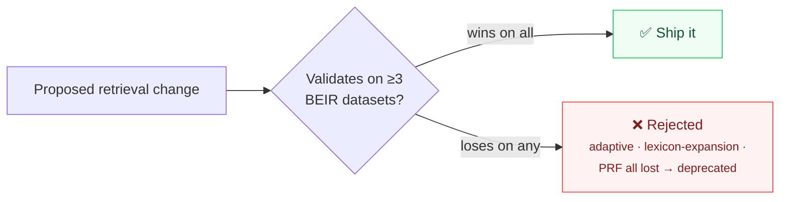

When an agent needs to pull relevant context out of a large corpus, the obvious instinct
is to reach for something sophisticated — query expansion, pseudo-relevance feedback,
learned dense retrieval. KAOS deliberately **defaults to plain BM25**, the classic
lexical algorithm you saw in [search text with BM25](/how-to/search-text-with-bm25).

That's not laziness. It's evidence.

## What the benchmarks showed

KAOS evaluated retrieval strategies across multiple [BEIR](https://github.com/beir-cellar/beir)
datasets (NFCorpus, SciFact, FiQA) — the standard for *cross-domain* retrieval quality.
The fancier techniques lost:

- An **adaptive retrieval** pipeline scored **worse** than plain BM25 cross-domain
  (e.g. ~0.231 vs ~0.296 NDCG@10 on NFCorpus). It's now deprecated.
- **Lexicon expansion** hurt cross-domain results (roughly −18% to −22% NDCG@10).
- **Pseudo-relevance feedback** also hurt (roughly −6% to −12%).

The pattern: techniques that cherry-pick well on one or two queries tend to *degrade*
average quality across domains. They optimize for the demo, not the distribution.

## The principle

KAOS encodes this as a rule: **any change to the retrieval pipeline must be validated on
at least three BEIR datasets before shipping.** A win on a handful of queries is not
evidence of correctness — it's how retrieval regressions get merged.

So plain BM25 is the production default, and the more aggressive techniques (synonym
expansion, HyDE) are *available* to an agent but must be **justified from observed
results** — used only when the agent identifies a specific vocabulary gap, not applied
blanketly.

## The lesson beyond retrieval

This is a recurring KAOS stance: prefer the simple, well-understood default; make the
clever thing opt-in and accountable to a metric. It shows up again in the
[typed-output discipline](/concepts/typed-llm-programming) — the system is built to
resist plausible-but-unmeasured complexity.
