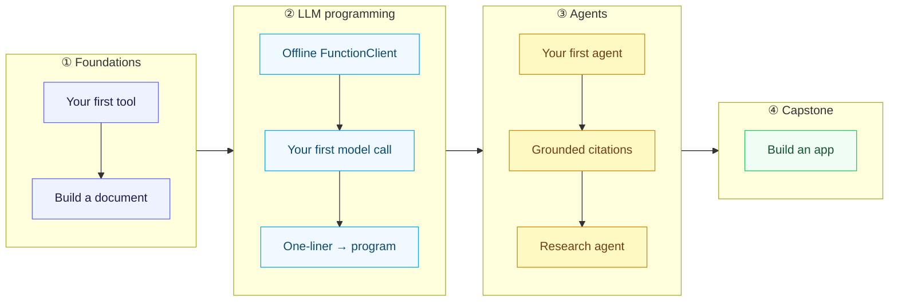

KAOS docs are organized the [Diátaxis](https://diataxis.fr/) way — tutorials (learn),
how-to guides (do a task), reference (look up facts), and explanation (understand).
Different readers need different doors. Find yours.

## "Just show me it works"

You want proof, fast — no setup, no key.

1. [Run your first example](/get-started/first-example) — deterministic, ~10 seconds.
2. [Browse the gallery](/gallery) — pick any card, one `uv run`.
3. [How KAOS fits together](/architecture) — the 60-second mental model.

## "Teach me, step by step"

You want to learn KAOS properly, building as you go. Follow the **golden path** —
each tutorial builds on the last, all runnable offline:

1. [Your first tool](/tutorials/first-tool)
2. [Build a document](/tutorials/build-a-document)
3. [Offline LLM with FunctionClient](/tutorials/offline-llm-with-functionclient)
4. [Your first model call](/tutorials/first-model-call)
5. [From a one-liner to a typed program](/tutorials/oneliner-to-call-to-program)
6. [Your first agent](/tutorials/first-agent)
7. [Grounded citations](/tutorials/grounded-citations)
8. [A research agent with citations](/tutorials/research-agent-citations)
9. [Build an app](/tutorials/build-an-app) (capstone)

## "I have a specific task"

You're competent and want a recipe, not a lesson. The how-to cookbook covers tasks like:

- [Ingest a PDF](/how-to/ingest-a-pdf), [Office doc](/how-to/ingest-office-docs), or [web page](/how-to/web-page-to-ast)
- [Run SQL over data](/how-to/run-sql-analytics), [extract citations](/how-to/extract-citations), [parse email](/how-to/parse-email)
- [Find near-duplicates](/how-to/find-near-duplicates), [cluster a corpus](/how-to/cluster-a-corpus), [query a knowledge graph](/how-to/query-the-session-graph)
- [Fail over across providers](/how-to/provider-failover), [control agent permissions](/how-to/configure-permissions)

## "I want the facts"

You want exact API, CLI, tool, and setting details. The [reference](/reference/packages)
has the package map, [CLI](/reference/cli), [MCP tools](/reference/mcp-tools),
[environment variables](/reference/env-vars), [glossary](/reference/glossary), and more.

## "I want to understand the design"

You want the *why*. Start with [how KAOS fits together](/architecture); the
[concepts](/concepts/the-8-step-turn-loop) section explains the
[agent loop](/concepts/the-8-step-turn-loop), [memory](/concepts/memory-as-context-assembly),
[retrieval choices](/concepts/why-plain-bm25), the
[cost-as-a-contract](/concepts/cost-as-a-contract) model, and
[grounded citations](/concepts/grounding-and-verification). The
[glossary](/reference/glossary) cross-links every term.

## "I want to extend KAOS"

You're a contributor or module author. Start with [your first tool](/tutorials/first-tool)
and [how KAOS fits together](/architecture), then
[add your own app template](/how-to/add-a-template-kind),
[add typed settings](/how-to/add-typed-settings), and adopt the
[offline-testing seam](/concepts/the-offline-seam) so your examples stay deterministic.

## "I want to use KAOS from an AI agent"

You want KAOS tools inside Claude Code, Codex, or another MCP client:
[connect an AI tool](/how-to/connect-an-ai-tool), [serve a runtime over MCP](/tutorials/serve-over-mcp),
[serve over HTTP with auth](/how-to/serve-over-http), and the
[MCP tools reference](/reference/mcp-tools) for what each package exposes.
